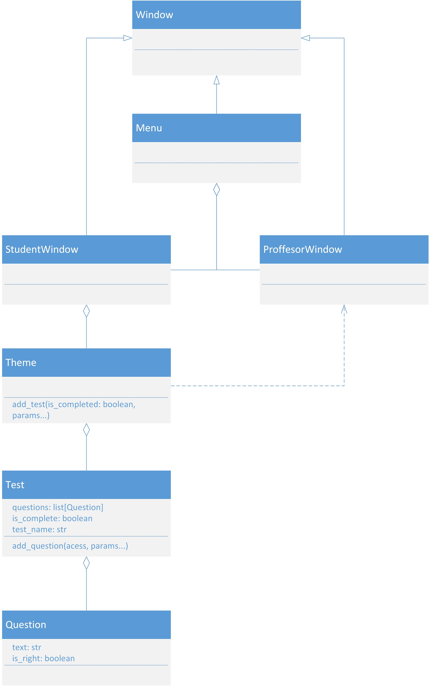

# EquTest - Методичні вказівки щодо нотації та процесу розробки

## Нотація

В пайтоні використовується нотація [**pep8**](https://peps.python.org/pep-0008/), стислий переказ основних правил нотації:
- назви змінних, методів та функцій пишуться в так званому snake_case, тобто кожне слово відділяється нижнім підкресленням *(the__name__of_your_variable)*
- через специфіку мови в пайтоні немає ні констант ні приватних ні захищених полів, 
тому візуально константи відділяють капсом *(CONSTANT)*, захищені методи вписуються з нижніми підкресленнями *(\_protected\_*),
а приватні з двома *(\_\_private\_\_)*, те саме стосується і методів
- класи називаються в PascalCase, тобто всі слова разом і відділяються великими буквами *(YourClass_name_)*
- модулі називаються з маленької букви і розподіляються по файлам

навіть з використанням нотації важливо називати змінні, поля, методи і класи відповідно до їх функціоналу *(а не a, b, my_function)*

## Git

Як систему контролю версій буде використовуватися Git, а точніше настільний інтерфейс над ним - **GitHub Desktop**

Щоб почати розробку потрібно зробити наступні кроки *(виходячи з того, що ви читаєте цей файл, ви вже долучені до GitHub репозиторію і маєте встановлений додаток)*:
- відкрити вкладку **File** у верхньому правому куті екрану
- натиснути **Clone Repository** вибрати зі списку **EquTest** і папку де буде клоновано репозиторій
- відкрити його за допомогою будь-якого середовища розробки *(я раджу PyCharm)*
- якщо потрібно внести зміні, створити нову вітку нажавши **Current Branch** -> **New Branch**, дати назву відповідно до
нотації і нажати **Create Branch**
- коли внесені зміни перейти назад в **GitHub Desktop** в лівому нижньому куті в полі **Summary** ввести назву коміту,
в поле **Description** ввести опис змін, які були внесені
- далі натиснути **Commit** після чого **Push** і створити запит на злиття віток

## Теоретичні розрахунки

## Корисні матеріали

- [**pep8**](https://peps.python.org/pep-0008/) - нотація
- [**PyQt5**](https://doc.qt.io/qtforpython-6/) - документація PyQt5
- [**GitHub**](https://docs.github.com/en/get-started/quickstart/hello-world) - документація GitHub
